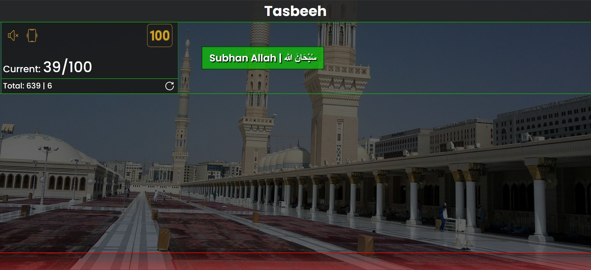

# 🕌 Digital Tasbih Website

A responsive digital **Tasbih (Counter) Website** built using **HTML, CSS, and JavaScript**.  
It provides an interactive tasbih counter with dynamic UI changes and customizable tasbih-verses.

---

## ✨ Features
- 🔢 **Tasbih Counter** – Keep track of current and total counts.
- 🌆 **Dynamic Background** – Background image opacity increases as the counter increments and decreases when decremented.
- 🔄 **Auto Background & Verse Change** – After completing one tasbih (33 or 100 counts), the background image and tasbih-verse automatically change.
- 🕌 **Custom Verse Selection** – Click on the tasbih-verse to change it manually.
- ♻️ **Reset Option** – Reset the total progress and start fresh.
- 📱 **Responsive Design** – Works seamlessly on desktop, tablet, and mobile.

---

## 🖼️ Screenshots
### 💻 Desktop View


### 📱 Mobile View


### 🌆 Alternate Background Example


---

## 🛠️ Tech Stack
- **HTML5**
- **CSS3**
- **JavaScript (ES6)**

---

## 🚀 How to Run
1. Clone the repository:
   ```bash
   git clone https://github.com/yourusername/digital-tasbih.git
